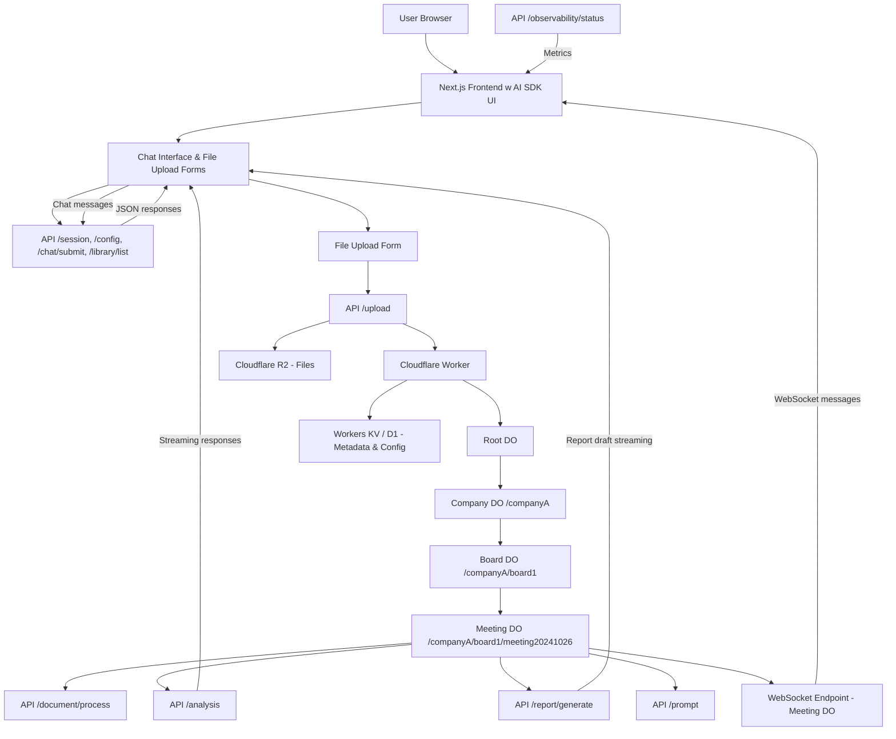

# BoardAIssistant.com API Documentation

BoardAIssistant.ai’s API is now designed for a composable, hierarchical system leveraging Cloudflare Workers and Durable Objects to provide persistent, low‑latency processing for board document analysis, AI reporting, and realtime collaboration. Our API is divided into two groups:

1.  **Next.js API / Server Actions:** These endpoints handle lightweight interactions such as authentication, chat messaging, configuration, document library queries, and session management. They run within our full‑stack Next.js 15 application deployed via the opennext adapter on Cloudflare Workers.
2.  **Cloudflare Worker Endpoints (Durable Objects):** These endpoints power the heavy‑processing tasks. They manage the hierarchical structure of our system—where each URL segment represents a persistent Durable Object instance (Root, Company, Board, Meeting, and optionally Section/Topic DOs). These endpoints handle file uploads, document processing (using Gemini Flash 2.0 and unstructured.io for content extraction), AI analysis, report generation, prompt management, and realtime WebSocket notifications.

## Part 1: Next.js API / Server Actions

These endpoints are exposed as part of our Next.js application and are responsible for:

### 1.1 Global Configuration & Settings

*   **GET /api/config**

    *   Description: Returns global settings and default prompt templates (e.g., for data inconsistency analysis, fact-checking).
    *   Response Example:

    ```json
    {
      "defaultPrompts": {
        "data_inconsistency": "Generate a concise summary of data inconsistencies...",
        "fact_check": "Identify and report any factual inaccuracies..."
      },
      "corporatePolicies": {
        "oecd": "OECD corporate governance guidelines...",
        "basel": "Basel accords compliance..."
      },
      "settings": {
        "maxUploadSize": "150MB",
        "rateLimit": "30 messages per 24h"
      }
    }
    ```

### 1.2 Chat and Interaction Endpoints

*   **POST /api/chat**

    *   Description: Accepts chat messages from the client and streams a response using the AI SDK’s streaming functions.
    *   Request Example:

    ```json
    {
      "messages": [
        { "role": "user", "content": "What are our board risks?" },
        { "role": "assistant", "content": "Analyzing..." }
      ]
    }
    ```

    *   Response: A streaming JSON response that includes the generated message (with tool calls and annotations if applicable).

### 1.3 Document Library Endpoints

*   **GET /api/library/list**

    *   Description: Lists documents uploaded by the user with metadata (file name, upload date, etc.).
    *   Response Example:

    ```json
    [
      {
        "documentId": "doc001",
        "fileName": "board_pre-read_Q32024.pdf",
        "uploadedAt": "2025-01-30T12:00:00Z"
      },
      {
        "documentId": "doc002",
        "fileName": "minutes_20241026.pdf",
        "uploadedAt": "2025-01-31T09:30:00Z"
      }
    ]
    ```

## Part 2: Cloudflare Worker Endpoints (Durable Objects)

Our heavy‑processing endpoints run in Cloudflare Workers and leverage Durable Objects for persistent state. The hierarchical structure is as follows:

*   Root DO: Manages global settings and maps company identifiers.
*   Company DOs (/companyA, etc.): Store company-specific policies, board lists, and access controls.
*   Board DOs (/companyA/board1, etc.): Maintain board meeting lists.
*   Meeting DOs (/companyA/board1/meeting20241026): Handle file uploads, document processing, AI analysis, report generation, user annotations, and email draft generation.
*   Section DOs (Optional): Further subdivide meeting content (e.g., finances, risk) for specialized processing.

### 2.1 Document Upload and Processing

*   **POST /upload**

    *   Description: Accepts file uploads and routes them based on the URL (e.g. /companyA/board1/meeting20241026/upload). Files are stored in Cloudflare R2, and metadata is recorded in the Meeting DO state.
    *   Response Example:

    ```json
    {
      "success": true,
      "filePointer": "r2://companyA/board1/meeting20241026/board_pre-read_Q32024.pdf",
      "metadata": { "fileName": "board_pre-read_Q32024.pdf", "uploadedAt": "2025-01-30T12:00:00Z" }
    }
    ```
*   **POST /document/process**

    *   Description: Initiates processing of an uploaded document. The Meeting DO reads the file from R2, sends it to the AI engine (e.g. Gemini Flash 2.0 with unstructured.io for OCR), and queues a processing job.
    *   Request Example:

    ```json
    {
      "documentId": "doc001",
      "filePointer": "r2://companyA/board1/meeting20241026/board_pre-read_Q32024.pdf",
      "processingOptions": { "extractTables": true, "includeImages": false }
    }
    ```

    *   Response Example:

    ```json
    {
      "success": true,
      "jobId": "job-xyz123",
      "status": "queued",
      "initialResults": null
    }
    ```

### 2.2 AI Analysis and Report Generation

*   **POST /analysis**

    *   Description: For a given document (from a Meeting DO), triggers AI analysis (data inconsistency, fact-checking, etc.) by sending the extracted text and metadata to the AI engine.
    *   Request Example:

    ```json
    {
      "documentId": "doc001",
      "analysisType": "data_inconsistency",
      "parameters": { "threshold": 0.75 }
    }
    ```

    *   Response Example:

    ```json
    {
      "success": true,
      "analysisId": "analysis-abc456",
      "status": "processing",
      "metadata": { "submittedAt": "2025-01-30T12:15:00Z" }
    }
    ```
*   **POST /report/generate**

    *   Description: Aggregates analysis results and user inputs to generate a draft report or email.
    *   Request Example:

    ```json
    {
      "meetingId": "meeting20241026",
      "reportOptions": { "includeSummary": true, "detailedSections": ["financial", "risk"] }
    }
    ```

    *   Response Example:

    ```json
    {
      "success": true,
      "report": "Draft email content and report summary..."
    }
    ```

### 2.3 Prompt Management & Tool Invocation

*   **POST /prompt**

    *   Description: Creates or updates prompt templates used across our AI workflows. This endpoint also logs prompt version changes for optimization.
    *   Request Example:

    ```json
    {
      "promptId": "optional-for-update",
      "version": "v1.2",
      "description": "Prompt for data inconsistency analysis",
      "content": "Generate a concise summary identifying inconsistencies in the provided document..."
    }
    ```

    *   Response Example:

    ```json
    {
      "success": true,
      "promptId": "prompt-789",
      "version": "v1.2"
    }
    ```
*   **WebSocket /ws/\* Endpoints**

    *   Description: Durable Objects expose realtime WebSocket endpoints (e.g., wss://boardai.example.com/ws/companyA/board1/meeting20241026) to send state updates, tool results, and error messages to connected clients.
    *   Message Types Include:
        *   state – Updates on file processing and analysis progress.
        *   tool\_result – Results from tool invocations after human confirmation.
        *   error – Error notifications.
        *   message – General broadcast messages.
    *   Client Example:

    ```javascript
    const ws = new WebSocket("wss://boardai.example.com/ws/companyA/board1/meeting20241026");
    ws.onmessage = (event) => {
      const msg = JSON.parse(event.data);
      // Process messages based on msg.type (state, tool_result, error, etc.)
    };
    ```

### 2.4 Observability and Logging

*   **GET /observability/status**

    *   Description: Returns metrics, logs, and operational status from our Durable Objects. This includes processing times, error rates, and job logs.
    *   Response Example:

    ```json
    {
      "averageProcessingTimeMs": 85,
      "currentDOCount": 123,
      "errorRate": "0.5%",
      "logs": [
        "Job job-xyz123 started at 2025-01-30T12:15:00Z",
        "Job job-xyz123 completed successfully"
      ]
    }
    ```

## Part 3: Authentication & Security Considerations

*   **Next.js API Endpoints:** All lightweight endpoints verify user sessions via Supabase.
*   **Cloudflare Worker Endpoints (Durable Objects):** Access is controlled via URL routing. DO state is secured, and sensitive keys for R2, D1, and Workers AI are never exposed to the client.

## Part 4: Data Formats and Streaming

*   **JSON:** Primary response format for all endpoints.
*   **Streaming Responses:** Endpoints using the AI SDK’s streamText return streaming responses (using text or data stream protocols).
*   **Multipart/Form-Data:** Used for file uploads (e.g., the /upload endpoint).

## Part 5: Error Handling and API Versioning

*   **Error Handling:** All endpoints return standardized error responses with appropriate HTTP status codes.
*   **API Versioning:** Future versions will use URL prefixes (e.g., /v2/upload) or HTTP headers for versioning.

## Mermaid Diagram: Full MVP App Flow



## Conclusion

This API.md document details our full‑stack API design for BoardAIssistant.ai. We leverage a full‑stack Next.js approach to handle lightweight client interactions, while Cloudflare Workers and a hierarchical Durable Object architecture power our heavy‑processing endpoints. This design supports realtime streaming of AI responses, file uploads, document analysis, and report generation—all while enforcing strict security and type safety.