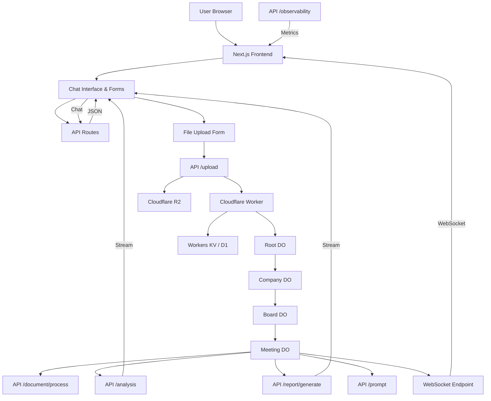

Below is an improved API documentation reflecting our new, composable, hierarchical design for BoardAIssistant.ai. Our system leverages Cloudflare Workers and Durable Objects to partition the system by company, board, meeting (and optionally section/topic) so that each entity has its own persistent, low‑latency endpoint. The lightweight interactions (authentication, chat, configuration, document listing) are handled by Next.js API routes and server actions running on Cloudflare via the opennext adapter, while heavy‑processing tasks (file uploads, document processing, AI analysis, report generation, prompt management, observability, and real‑time notifications) are handled by Cloudflare Workers/Durable Objects. At the end, a full‑stack Mermaid diagram illustrates the overall MVP app flow.

## BoardAIssistant.com API Documentation

BoardAIssistant.ai’s API is split into two main groups:

1.  **Next.js API / Server Actions:**

    These endpoints support lightweight, client‑facing interactions including user sessions, configuration, chat messaging, and document library queries. They run as part of our Next.js 15 application deployed to Cloudflare Workers via the opennext adapter.
2.  **Cloudflare Worker Endpoints (Durable Objects):**

    These endpoints handle the heavy‑processing tasks such as document uploads/processing, AI analysis, report generation, prompt management, and real‑time notifications via WebSockets. They leverage Cloudflare Durable Objects in a hierarchical structure (Root, Company, Board, Meeting, and optionally Section/Topic DOs) to maintain persistent state and low‑latency interactions at the edge.

## Part 1: Next.js API / Server Actions

These endpoints are responsible for authentication, session management, global configuration, lightweight chat interactions, and document library management.

### 1.1 Authentication & Session Management

*   **GET /api/session**

    *   Description: Returns the current user session using Supabase authentication.
    *   Response Example:

    ```json
    {
      "id": "user-uuid",
      "email": "user@example.com",
      "full_name": "User Name",
      "role": "board_member"
    }
    ```
*   **POST /api/auth/login**

    *   Description: Authenticates the user and creates a session.
    *   Request Example:

    ```json
    {
      "email": "user@example.com",
      "password": "password123"
    }
    ```

    *   Response Example:

    ```json
    {
      "success": true,
      "sessionToken": "session-token",
      "user": { "id": "user-uuid", "email": "user@example.com", "full_name": "User Name" }
    }
    ```
*   **POST /api/auth/logout**

    *   Description: Terminates the current session.
    *   Response Example:

    ```json
    { "success": true, "message": "Logged out successfully" }
    ```

### 1.2 Global Configuration & Settings

*   **GET /api/config**

    *   Description: Retrieves global system settings such as default prompts, corporate governance policies (OECD, Basel, etc.), maximum upload sizes, and rate limits.
    *   Response Example:

    ```json
    {
      "defaultPrompts": {
        "data_inconsistency": "Generate a summary highlighting any data inconsistencies...",
        "fact_check": "Review the document for factual accuracy and provide corrections..."
      },
      "corporatePolicies": {
        "oecd": "OECD corporate governance guidelines...",
        "basel": "Basel accords compliance..."
      },
      "settings": {
        "maxUploadSize": "150MB",
        "rateLimit": "30 messages per 24h"
      }
    }
    ```

### 1.3 Chat & Interaction Endpoints

*   **POST /api/chat/submit**

    *   Description: Submits a chat message and returns a streamable response using the AI SDK.
    *   Request Example:

    ```json
    {
      "messages": [
        { "role": "user", "content": "What are our board risks?" },
        { "role": "assistant", "content": "Analyzing..." }
      ]
    }
    ```

    *   Response Example:

        (Streamed text response)

    ```json
    {
      "stream": "data: {\"id\": \"msg123\", \"role\": \"assistant\", \"content\": \"Based on your input, the key risks are...\"}\n\n"
    }
    ```
*   **POST /api/chat/reset**

    *   Description: Clears the current chat session (for example, after a completed analysis).
    *   Response Example:

    ```json
    { "success": true, "message": "Chat session reset" }
    ```
*   **GET /api/chat/history**

    *   Description: Returns the chat history for the authenticated user.
    *   Response Example:

    ```json
    [
      { "id": "msg001", "role": "user", "content": "Hello, update me on our latest risk analysis." },
      { "id": "msg002", "role": "assistant", "content": "Here is the latest analysis..." }
    ]
    ```

### 1.4 Document Library Endpoints

*   **GET /api/library/list**

    *   Description: Retrieves a list of documents uploaded by the user along with metadata (file name, upload date, type).
    *   Response Example:

    ```json
    [
      { "documentId": "doc001", "fileName": "board_pre-read_Q32024.pdf", "uploadedAt": "2025-01-30T12:00:00Z" },
      { "documentId": "doc002", "fileName": "minutes_20241026.pdf", "uploadedAt": "2025-01-31T09:30:00Z" }
    ]
    ```

## Part 2: Cloudflare Worker Endpoints (Durable Objects)

These endpoints implement the heavy‑processing and persistent storage tasks. Our backend is structured hierarchically using Durable Objects:

*   Root DO: Manages global settings and top‑level company mappings.
*   Company DOs (/companyA, /companyB): Store company policies, board lists, and access controls.
*   Board DOs (/companyA/board1): Manage board-level settings and a list of meetings.
*   Meeting DOs (/companyA/board1/meeting20241026): Handle document uploads, AI analysis, report generation, and user annotations.

### 2.1 Document Upload and Processing

*   **POST /upload**

    *   Description:

        Accepts multipart/form-data for document uploads. Based on the URL path (e.g. /companyA/board1/meeting20241026/upload), the request is routed to the corresponding Meeting DO. The file is stored in Cloudflare R2, and metadata is saved in the DO’s state.
    *   Request:
        *   File upload (PDF)
        *   URL path determines company/board/meeting
    *   Response Example:

    ```json
    {
      "success": true,
      "filePointer": "r2://companyA/board1/meeting20241026/board_pre-read_Q32024.pdf",
      "metadata": { "fileName": "board_pre-read_Q32024.pdf", "uploadedAt": "2025-01-30T12:00:00Z" }
    }
    ```
*   **POST /document/process**

    *   Description:

        Triggers document processing in the Meeting DO. It reads the file (using the stored pointer), then sends the file content to the AI engine (e.g., Gemini Flash 2.0 combined with unstructured.io for OCR and markdown extraction).
    *   Request Example:

    ```json
    {
      "documentId": "doc001",
      "filePointer": "r2://companyA/board1/meeting20241026/board_pre-read_Q32024.pdf",
      "processingOptions": { "extractTables": true, "includeImages": false }
    }
    ```

    *   Response Example:

    ```json
    {
      "success": true,
      "jobId": "job-xyz123",
      "status": "queued",
      "initialResults": null
    }
    ```

### 2.2 AI Analysis and Report Generation

*   **POST /analysis**

    *   Description:

        Initiates AI analysis (data inconsistency, fact-checking, missing information) on a document by forwarding the document’s extracted text and metadata from the Meeting DO to the AI SDK (using Gemini Flash or Anthropic, as configured).
    *   Request Example:

    ```json
    {
      "documentId": "doc001",
      "analysisType": "data_inconsistency",
      "parameters": { "threshold": 0.75 }
    }
    ```

    *   Response Example:

    ```json
    {
      "success": true,
      "analysisId": "analysis-abc456",
      "status": "processing",
      "metadata": { "submittedAt": "2025-01-30T12:15:00Z" }
    }
    ```
*   **POST /report/generate**

    *   Description:

        Generates a draft report or email draft based on the analysis results stored in the Meeting DO. Collates AI analysis, user annotations, and previous meeting data into a structured draft for board review.
    *   Request Example:

    ```json
    {
      "meetingId": "meeting20241026",
      "reportOptions": { "includeSummary": true, "detailedSections": ["financial", "risk"] }
    }
    ```

    *   Response Example:

    ```json
    {
      "success": true,
      "report": "Draft email content and report summary..."
    }
    ```

### 2.3 Prompt Management and Tool Invocation

*   **POST /prompt**

    *   Description:

        Creates or updates prompt templates used by our AI analysis workflows. Also logs changes for observability and optimization.
    *   Request Example:

    ```json
    {
      "promptId": "optional-for-update",
      "version": "v1.2",
      "description": "Prompt for data inconsistency analysis",
      "content": "Generate a concise summary identifying inconsistencies in the provided document..."
    }
    ```

    *   Response Example:

    ```json
    {
      "success": true,
      "promptId": "prompt-789",
      "version": "v1.2"
    }
    ```
*   **WebSocket /ws/\* Endpoints**

    *   Description:

        These endpoints are exposed by Durable Objects to provide realtime updates and notifications to the frontend. Clients connect via WebSocket (e.g., wss://boardai.example.com/ws/companyA/board1/meeting20241026) and receive state updates, tool result annotations, and error notifications.
    *   Message Types Include:
        *   state: Updates on DO progress (e.g., file processing, analysis progress)
        *   tool\_result: Results for tool calls after human confirmation (if applicable)
        *   error: Error notifications
        *   message: General broadcast messages
    *   Client Example:

    ```javascript
    const ws = new WebSocket("wss://boardai.example.com/ws/companyA/board1/meeting20241026");
    ws.onmessage = (event) => {
      const msg = JSON.parse(event.data);
      // Process message based on msg.type (state, tool_result, error, etc.)
    };
    ```

### 2.4 Observability and Logging

*   **GET /observability/status**

    *   Description:

        Provides operational metrics and logs from the Durable Objects environment. This includes processing times, current DO counts, error rates, and log entries.
    *   Response Example:

    ```json
    {
      "averageProcessingTimeMs": 85,
      "currentDOCount": 123,
      "errorRate": "0.5%",
      "logs": [
        "Job job-xyz123 started at 2025-01-30T12:15:00Z",
        "Job job-xyz123 completed successfully"
      ]
    }
    ```

## 3. Authentication & Security Considerations

*   Next.js API Endpoints:

    All lightweight endpoints (session, chat, library) verify user sessions via Supabase tokens.
*   Cloudflare Worker Endpoints (DOs):

    Access to DOs is controlled by URL-based routing. Durable Objects maintain internal state and enforce access via the hierarchical structure. Keys (for R2, D1, and Workers AI) are stored securely and never exposed on the client side.

## 4. Data Formats and Streaming

*   JSON: All endpoints return JSON responses, unless otherwise noted.
*   Streaming Responses: Endpoints using streamText from the AI SDK return streaming responses using the data stream protocol.
*   Multipart/Form-Data: Used for file uploads (e.g., /upload endpoint).

## 5. Error Handling and API Versioning

*   Error Handling:

    All endpoints return standardized error messages (with appropriate HTTP status codes) and log internal errors for observability.
*   API Versioning:

    Major changes will be versioned using URL prefixes (e.g., /v2/upload) or via HTTP headers.

## Mermaid Diagram: Full MVP App Flow

Below is a working Mermaid code diagram illustrating the full MVP app flow for our composable, full‑stack BoardAIssistant.ai solution:



## Conclusion

The above API.md now reflects our new system design for BoardAIssistant.ai. We utilize a full‑stack Next.js 15 + AI SDK UI solution deployed on Cloudflare Workers via opennext, combined with a hierarchical Durable Object structure that segments companies, boards, and meetings. This design supports realtime streaming, low‑latency processing, and persistent state while leveraging Cloudflare’s powerful edge infrastructure. The Mermaid diagram illustrates the end‑to‑end flow from the client to lightweight API endpoints and heavy processing endpoints deployed in Durable Objects.

Feedback on this design is welcome before proceeding to full‑scale implementation.